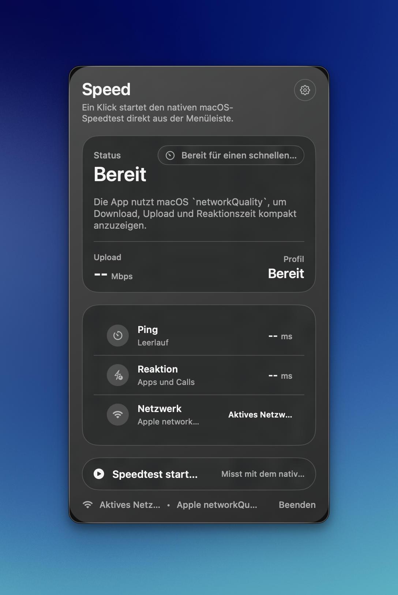
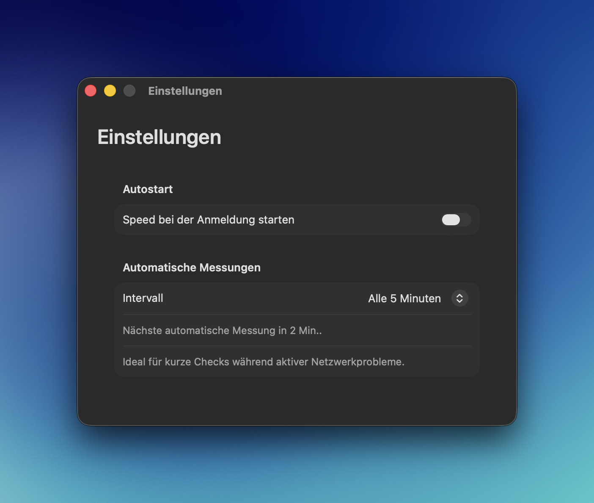

# Speed

Speed is a lightweight macOS menu bar app for quick network checks without leaving the menu bar.

## Preview





## What It Does

- Runs native macOS speed tests with `networkQuality`
- Shows download, upload, latency, and responsiveness in a compact popover
- Includes settings for launch at login and automatic test intervals

## Download

Download the latest build from [Releases](../../releases).

1. Download the newest `SpeedMenuBar-...-macOS.zip`
2. Move `SpeedMenuBar.app` to `/Applications`
3. Open the app from Applications and run tests from the menu bar

Note: release builds are currently ad-hoc signed and not notarized, so macOS may ask you to confirm the first launch.

## Build From Source

```bash
swift test
./scripts/build-app.sh
open dist/SpeedMenuBar.app
```

## Contributing

See [CONTRIBUTING.md](CONTRIBUTING.md).
