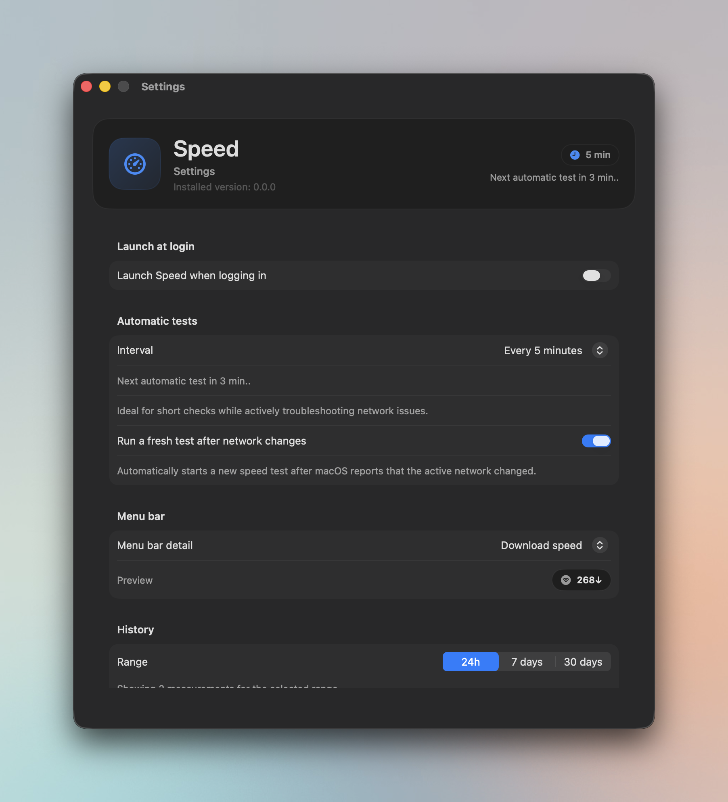
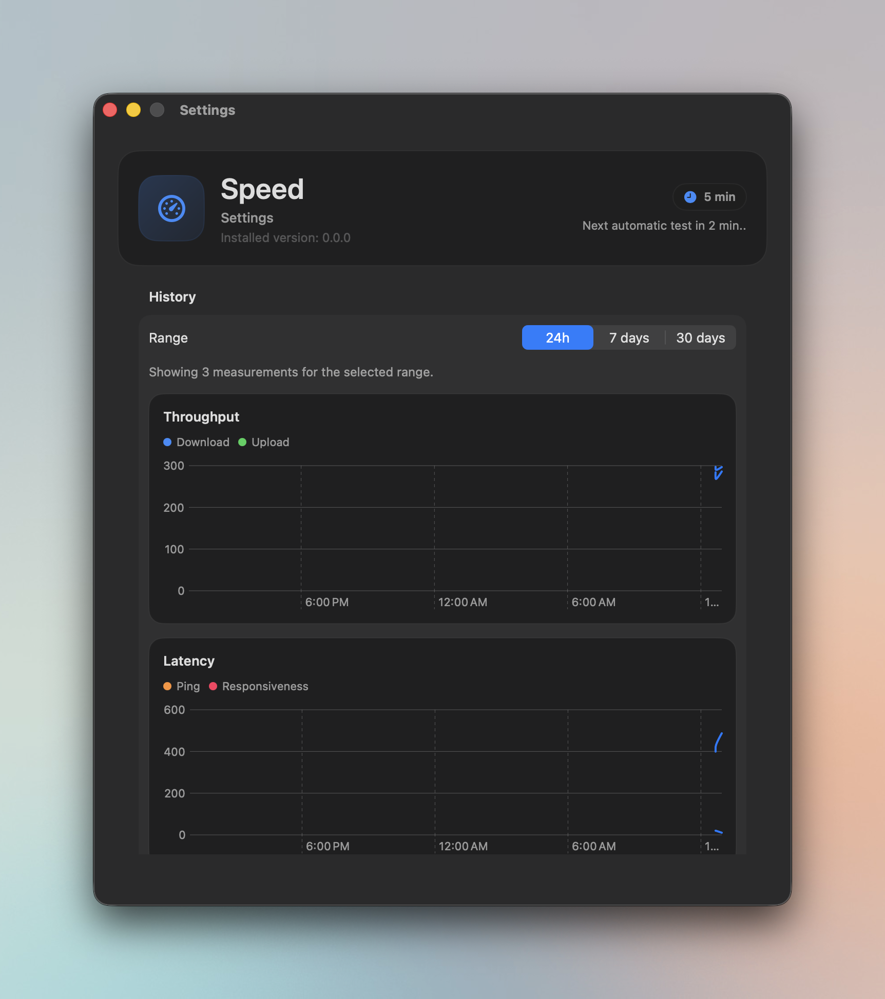

# Speed

Speed is a lightweight macOS menu bar app for running quick network checks without leaving the menu bar.

It uses Apple's native `networkQuality` tool and keeps the results easy to scan, easy to compare, and close at hand.

## Preview

### Menu bar popover


### Settings overview



### History and charts



## Features

- Runs native macOS speed tests with `networkQuality`
- Shows download, upload, ping, and responsiveness in a compact popover
- Stores measurement history locally and shows charts for 24 hours, 7 days, and 30 days
- Lists recent measurements for quick comparisons
- Supports automatic tests on a fixed interval
- Can automatically run a fresh test after a detected network change
- Lets you choose what the menu bar shows: icon only, download, ping, or download + upload
- Supports launch at login
- Includes built-in update checks and in-app update installation from GitHub releases
- Supports English and German

## Requirements

- macOS 14 or newer

## Download

Download the latest build from [Releases](../../releases).

1. Download the newest `SpeedMenuBar-...-macOS.zip`
2. Move `SpeedMenuBar.app` to `/Applications`
3. Open the app from Applications and start tests from the menu bar

Note: release builds are currently ad-hoc signed and not notarized, so macOS may ask you to confirm the first launch.

## Build From Source

```bash
swift test
./scripts/build-app.sh
open dist/SpeedMenuBar.app
```

## Project Notes

- Speed runs as a menu bar app and does not appear in the Dock
- Measurement history is stored locally on the Mac
- Automatic retests on network change are enabled from Settings

## Contributing

See [CONTRIBUTING.md](CONTRIBUTING.md).
